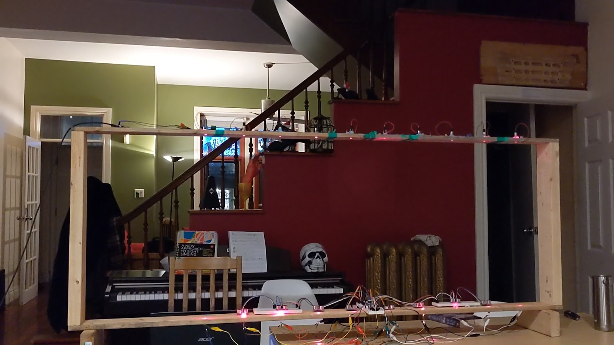
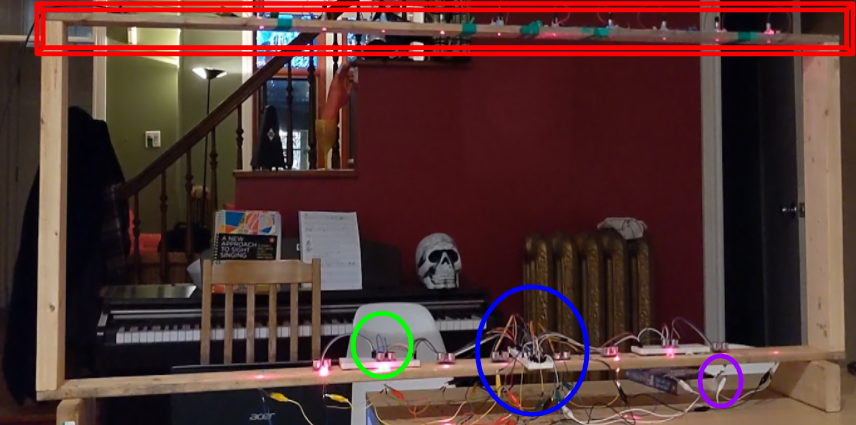
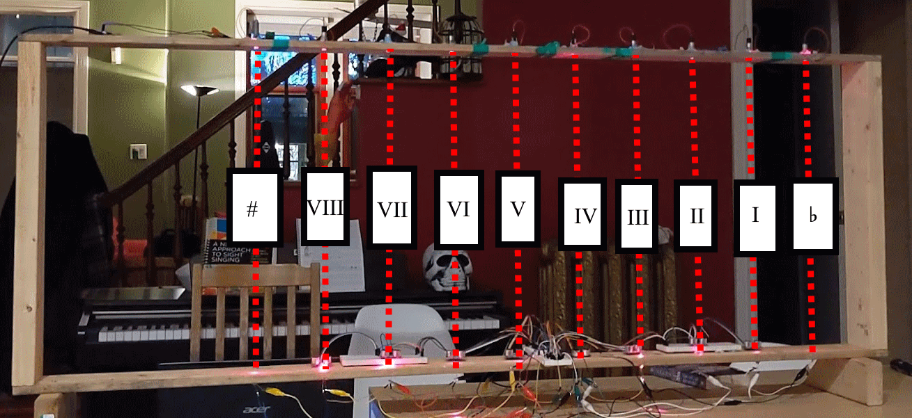
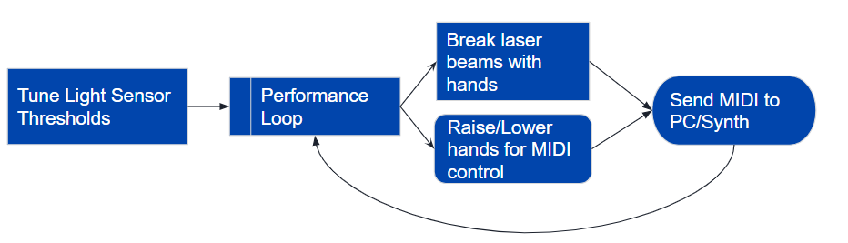
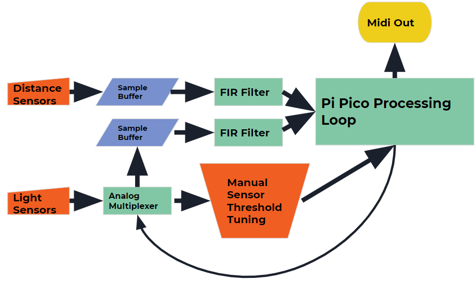
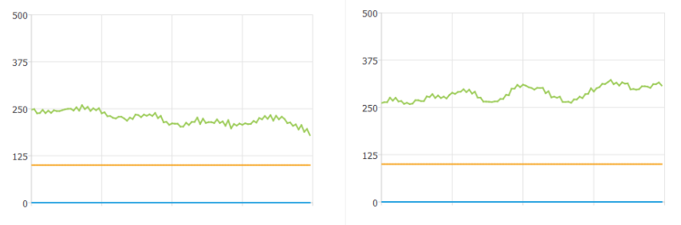

# Laser Harp Final Project

This is my write-up of the final project I completed for MUMT306 at McGill University in Fall 2021. 

## Demo

## Overview

For my final project I designed a Laser Harp. A Laser Harp is a type of digital music interface that uses the placement and positioning of a performers hands relative to a series of laser beams to activate notes and adjust musical control parameters. In my specific implemtation, the harp uses an array of phototransistors to detect the breaking of a laser beam, and a parallel array of ultrasonic distance sensors to detect the precise location of the performers hand relative to the height of the beam. My harp then uses this information to send MIDI signals over a USB connection, which can then be attached to any digital MIDI synthesizer or DAW. 

### Physical Structure

The harp is approximately two metres wide by half a metre tall, constructed out of wood. On the top of the frame is an array of laser diodes hooked up to a seperate 5V source from the rest of the harp(to prevent the lasers inducing noise for the other sensors). For most of the testing a nine volt battery and converter circuit was used as this secondary power source. The rest of the system was powered through the USB connection to my computer. 

On the lower part of the frame, in parallel with the laser array is an array of phototransistors inserted into pre-drilled holes in the wooden frame. These light sensors are then routed through a multiplexer into the main microcontroller. On the top of the lower bar of the frame is also a distance sensor correspond to eight of the ten laser beams(those which play musical notes), as well as an array of breadboards. The breadboards handle connecting the wiring for both the main microcontroller as well as all of the distance sensors. 

|Colour | Component|
|-------|----------|
|Red | Laser Array|
|Green | Sonar Sensor|
|Blue | Pi Pico/Mux |
|Purple | Phototransistor|

### Musical Interface

The harp maps its beams to notes in the following way:
  -The eight central notes are mapped one-to-one from left to right with each scale degree(in a C major scale by default). 
  -The leftmost beam is used to lower the pitch of any notes played by one semitone while held
  -The rightmost beam applies the same effect but raising any notes played by one semitone while held

*Seen from the audience side in this case, so left-right are flipped*

Before a performance can begin, the light sensors must be manually tuned corresponding to the ambient light conditions in the space, as well as to adjust for overall variances and unreliabilities with the electronic components. Other setup steps include specifying the scale the notes of the harp will be mapped to. After setup is complete, the performer engages with the instrument through physical gesture and positioning of their hands relative to the beam array. In a continous cycle, the performer recieves musical feedback from the sounds induced by their actions. From this, they can then move their hands horizontally and vertically to play new notes or to control the parameters of existing ones. Once they have done so, the instrument will measure this new set of data points and convert it into MIDI notes, which are sent to the computer which then produces further musical feedback, continuing the loop of the performance. 

## Implementation

**The Code For The Project Can Be Found Here: **

Internally the harp operates in the following way: 

It is continously sampling data from its two sources of information, the light sensor array and distance sensor arrays. 
The data from these is fed into circular buffers of size 100 and 10 respectively. On these buffers, a simple filtering algorithm is applied in order to smooth out
small fluctuations in the signal. In the case of the light sensors this filtered data is then checked against a pre-tuned set of thresholds, and if the software 
determines that indeed a laser beam is being blocked by the performers hand, a state in an array is adjusted to increase our confidence that a note is currently being played.
Next, the software checks(for each beam) whether it believes it is currently broken and combines this with its information about the location of the performers hands to determine whether it should play a note(or adjust an existing note). The Pi Pico then subsequently sends out all of the relevant musical control information over a MIDI connection to the host computer, and repeats its loop by sampling a new set of data.

### Hardware

One of my goals for the project was to make use of inexpensive, off-the-shelf electronic components. Of these components, the most expensive was the Pi Pico at $5 for the board (however the total cost of the 10 lasers was significantly higher). For the distance sensors, I used the (very popular and well documented) HRC-S04 ultrasonic time of flight sensors, which use a small speaker and microphone to detect the distance between the sensor and the nearest object facing it. For the laser diodes, I used commerical and low power lasers(the same kind that gets sold for toys) in order to avoid dealing with the safety concerns of using more powerful lasers, with the downside of not having beams that are visible without additional particulate matter added to the air. 

- [HRCS04 Distance Sensors](https://cdn.sparkfun.com/datasheets/Sensors/Proximity/HCSR04.pdf)
- [650nm 5mw Laser Diodes](https://www.adafruit.com/product/1054#technical-details)
- [HW5P-1 Phototransistors](https://cdn-shop.adafruit.com/product-files/2831/HW5P-1_2015__1_.pdf)
- [4051 Analog Multiplixer](https://www.ti.com/lit/ds/symlink/cd4051b.pdf?ts=1638812768510&ref_url=https%253A%252F%252Fwww.ti.com%252Fproduct%252FCD4051B)
- [Raspberry Pi Pico](https://datasheets.raspberrypi.com/rp2040/rp2040-datasheet.pdf)

### Software

For the software I used Circuitpython running on the Raspberry Pi Pico. I choose this platform due to the large amount of libraries and wide variety of software support for the goals I had. Additionally, it provided an IDE and core library similar to the Arduino platform we had already used in class. Some of the most useful libraries were the distance sensor library, the adafruit_midi library, and the uLab library(which implements a subset of the popular scientific computing package Numpy). However, I found the abilities of the available libraries lacking in many ways and I believe the overhead of the Circuitpython environment contributed quite a bit to the latency compared to if I had written the project purely in something like C or C++. 

- [Circuitpython](https://circuitpython.org/)
- [adafruit_hcsr04](https://circuitpython.readthedocs.io/projects/hcsr04/en/0.4.4/)
- [digitalIO](https://circuitpython.readthedocs.io/en/latest/shared-bindings/digitalio/index.html)/[analogIO](https://circuitpython.readthedocs.io/en/latest/shared-bindings/analogio/index.html)
- [uLab](https://circuitpython.readthedocs.io/en/latest/shared-bindings/ulab/)
- [adafruit_midi](https://circuitpython.readthedocs.io/projects/midi/en/latest/api.html)
- [usb_midi](https://circuitpython.readthedocs.io/en/latest/shared-bindings/usb_midi/index.html)

## Issues and Solutions

By far my biggest issues were with the complexity introduced by having a large amount of hardware components(18 sensors, 10 lasers, 3 breadboards, 60+ wires, etc.), and with unreliability and noise involving the sensors. A direct result of this was a large amount of latency in the final result.

### Complexity

I think my largest mistake was (possibly oweing to CS biases) expecting the complexity of the hardware to scale only linearly in the number of components. This did not occur. Instead, I used up all of the IO ports on my microcontroller and also needed a multiplexer to further expand my input/output capabilities. Additionally, wire management was very difficult due to the large number of things all needing to connect to a single point while being spread out over two metres of instrument. Ultimately the complexity of the hardware did not lead to much negative effects in the final product, but made the overall construction and work on the project quite difficult.

### Filtering

Extracting a reliable signal from the sensors(especially the analog light sensors) was the hardest part of the project. Both the sonar sensors and light sensors are highly sensitive to random noise, spikes, variable conditions, and simply choosing to change their performance characteristics at random. As an example, here is a picture of the (filtered!) sensor data from one of the light sensors, with the laser beam being open on the left and blocked on the right.

As one can see, the difference in sensor output between the two states is quite small and is comparable in size to the overall noise and variability of the sensors themselves.

To address this, I designed the software to work with large buffers of sensor data and to perform a variety of filtering operations and secondary checks before converting the information from the sensors to musical performance. By constructing a fairly convoluted filtering process, I did eventually manage to make it so that the only notes that will come from the instrument are those directly triggered by the performer, however this had drawbacks in terms of software complexity and latency. 

### Latency

The above described filtering process introduces a non-negligible amount of latency at each step, culminating in a final performance loop that can feature a fairly long delay from gestural input to the actual creation of sound. This stems from both the number of computational steps involved in the filtering, as well as needing to take a large amount of samples(and thus take a relatively large amount of time), as well as needing to set quite high thresholds inside the software to prevent the emission of 'ghost notes', requiring a longer time for the signal to ramp up and surpass the threshold. 

## Conclusions 

Over the course of this project, I learned a massive amount about electronics and hardware, as well as about signal processing and creating musical interfaces. I was also able to put to use a wide variety of the information I learned over the course of MUMT306, including use of the MIDI standard, low-level programming and interfacing microcontrollers with a PC. 

In terms of electronics, while I had some prior experience making small circuits, this was the truly large scale electronics project I've done and I had to pick up a wide variety of new skills. These included integrating a wide variety of components, researching and reading datasheets and component properties, learning to program raw IO on a microcontroller and how to test a complicated system to make sure all components are working. 

Going forward, I intend to keep working on(and hopefully using) my laser harp, and I have a few directions which I would have liked to implement in the project and which I believe can be explored in the future:

#### Future Analog Approaches

- Capacitors to smooth signals at source
- Higher quality wire connections and solder joints
- Seperated ground planes, more isolated components
- Higher quality sensors

#### Future Software Approaches
 - Implementing automatic sensor tuning
 - Reducing latency
 - More advanced/effective signal processing techniques
 - Making use of Pi Pico inbuilt PIO state machines
 - PC-side driver instead of serial interface

